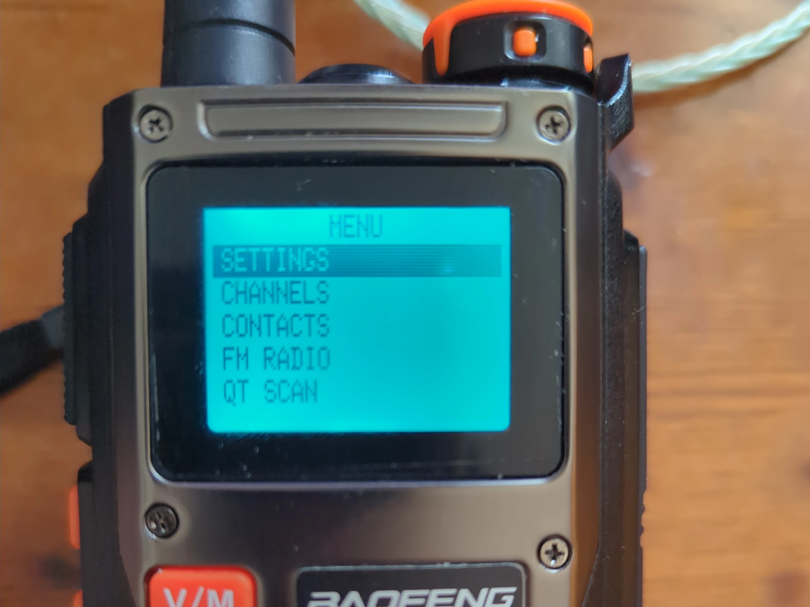
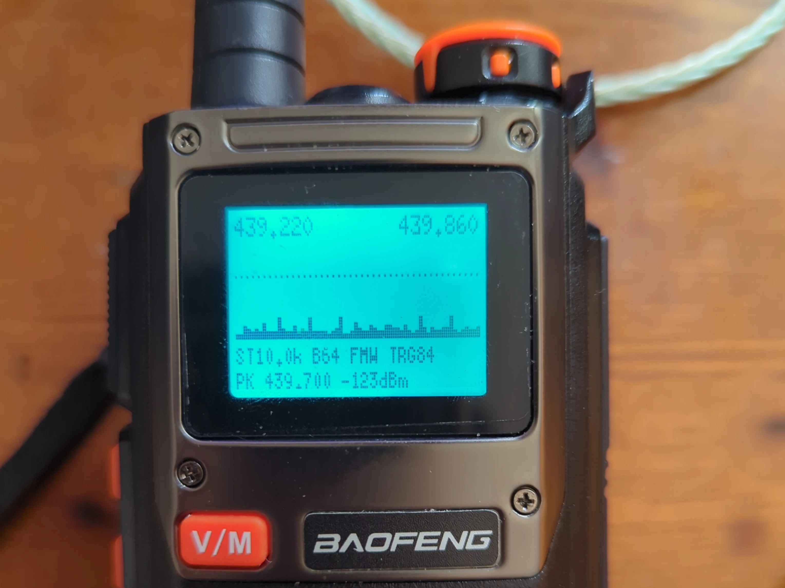
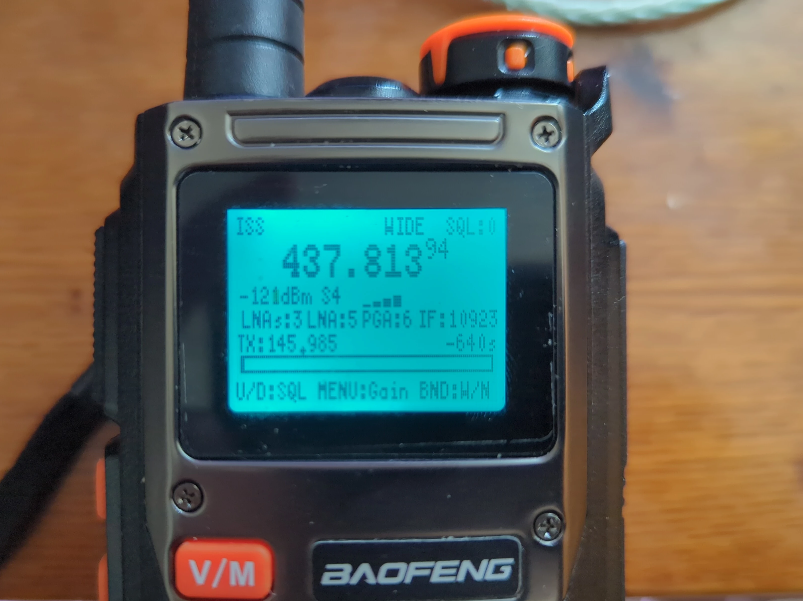
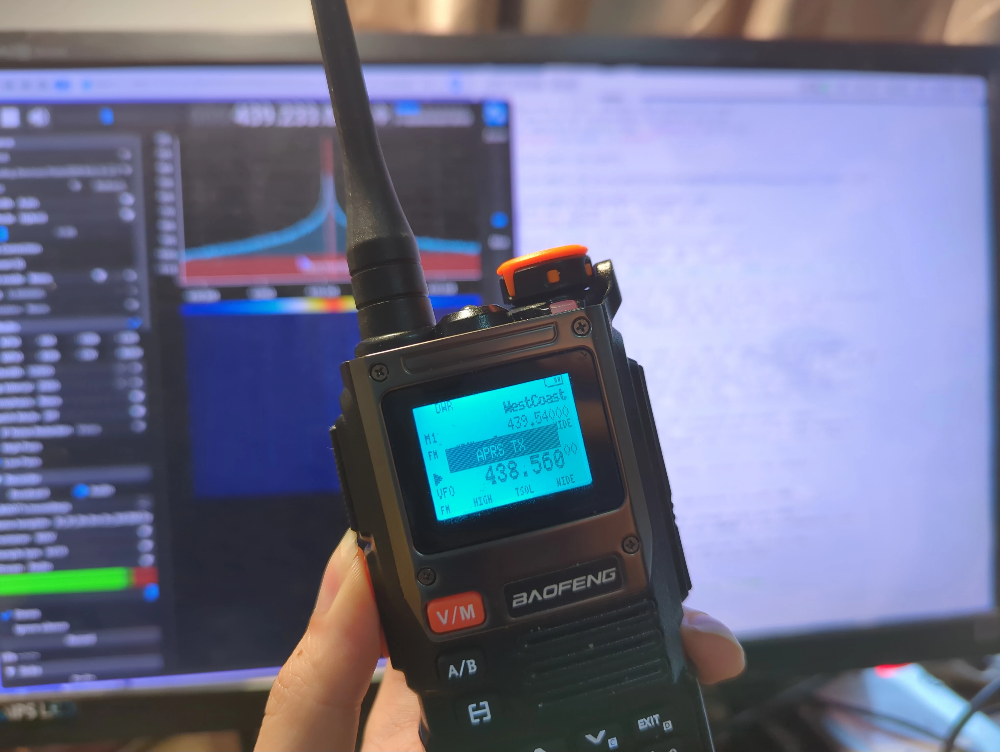
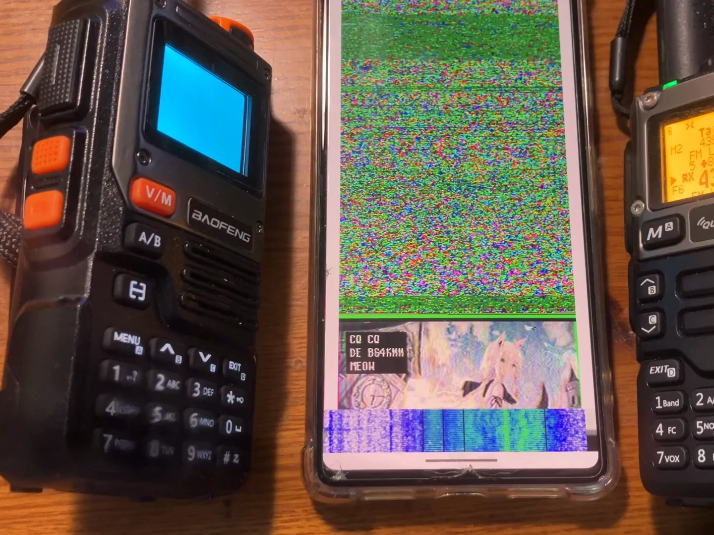

# Aura — 宝锋 UV-K61 系列开源Rust固件

[English](README.md) | **简体中文**

Aura是为宝锋 UV-K61系列手持电台（KD32F328CB主控）编写的Rust固件，完全独立的clean-room实现。

> [!WARNING]
> 使用本固件完全需要自行承担风险。可能会有潜在bug。Anyway, have fun~

## 扩频/超范围发射——使用前请阅读

Aura包含一个TX频率锁定设置（设置菜单里的`FLOCK`）。设为`Unlocked`时，电台可以在硬件合成器的全范围内发射，而不再局限于业余无线电频段分配。

这是大多数用户不需要的实验性功能：

- 在你所在司法管辖区，在授权频段外发射几乎肯定是违法的。
- 在PA未经校准的频率上驱动它可能损坏电台。

在发射前，请了解并遵守当地无线电法规，并持有相应执照。

## 功能特性

- 双VFO/信道操作，支持CTCSS、DCS、VOX等所有标准手持电台功能
- CW模式
- 频谱图
- APRS发射（AX.25 AFSK）
- Robot 36彩色SSTV图像发射
- 卫星过境追踪，支持多普勒频移自动修正收发
- 可自定义开机logo和开机音乐
- 通过自定义写频协议和CHIRP驱动支持CPS（写频）

## 截图

<table>
<tr>
<td width="33%"><br>主界面 — 双守候（信道+VFO）</td>
<td width="33%"><br>应用菜单</td>
<td width="33%"><br>频谱扫描</td>
</tr>
<tr>
<td width="33%"><br>卫星过境追踪（多普勒修正）</td>
<td width="33%"><br>APRS发射</td>
<td width="33%"><br>SSTV（Robot 36彩色）发射</td>
</tr>
</table>

## 与原厂固件的关系

（可能是）宝锋发布了UV-K6x系列的源码可见固件[cnt7/BAOFENG-UV-K6-Firmware](https://github.com/cnt7/BAOFENG-UV-K6-Firmware)，使用的是Baofeng Public License（BFPL-1.0）——一个自定义的非自由许可证，不允许以自由许可证重新分发修改版或衍生代码。

Aura没有使用、复制或衍生自那份代码的任何部分。每一行都是从零开始的独立clean-room实现。仅在硬件兼容性确有必要时，才对空中行为和flash布局做了逆向工程，这些情况都在代码内做了说明。Aura的CPS写频协议也刻意与原厂协议不兼容：握手字符串不同，帧格式也不同。

感谢宝锋以及该仓库的贡献者们公开源码供学习参考。

## 硬件

- **主控：** KD32F328CB（ARM Cortex-M0）
- **Flash：** XM25QH16C SPI NOR（2 MB）
- **射频/基带：** FD6818
- **显示驱动：** SC5260

## 编译

使用[Nix](https://nixos.org)：

```sh
nix develop
cargo build --release
```

不使用Nix：通过[rustup](https://rustup.rs)安装Rust。固定的stable版本和`thumbv6m-none-eabi`目标会从`rust-toolchain.toml`自动选择：

```sh
cargo build --release
cargo objcopy --release -- -O binary aura.bin
```

或者等价地，直接`make bin`。

## 刷机

Aura通过UV-K6x原厂UART bootloader刷入——和原厂固件用的是同一套机制，不是通过SWD或DFU。完整流程见[刷机教程](docs/Flashing-Guide.zh.md)（English: [Flashing Guide](docs/Flashing-Guide.md)），里面也包含了如何先备份SPI flash。

最简单的方式是用`tools/`里的Python工具：

```sh
pip install pyserial
python tools/flash.py aura.bin /dev/ttyUSB0
```

没有Python环境？可以用[BF-K6x-flash](https://github.com/sophiel-meow/BF-K6x-flash)，这是同一套协议的Rust CLI重实现：

```sh
git clone https://github.com/sophiel-meow/BF-K6x-flash tools/flash-rs
cargo build --release --manifest-path tools/flash-rs/Cargo.toml
make flash   # 或者: ./tools/flash-rs/target/release/flash aura.bin /dev/ttyUSB0
```

想要图形界面而不是命令行？原厂提供的官方刷机工具[`BFK6_Bootloader.exe`](https://github.com/cnt7/BAOFENG-UV-K6-Firmware/blob/main/BFK6_Bootloader.exe)也兼容Aura。它仅支持Windows且不开源（所以这里只放链接，不在本仓库中分发），但如果你只想要"选择文件 → 刷入"这种体验，这是最省心的选择。

## 写频（CPS）

信道、内存和电台设置都可以通过[CHIRP](https://chirpmyradio.com/)配合`tools/chirp_bfk6_aura.py`——Aura的CHIRP驱动——来写频。

CHIRP只有在开启**开发者模式（Developer Mode）**后才会加载这类第三方驱动模块：

1. 在CHIRP里，通过**Help → Developer Mode**开启它。
2. 开启开发者模式后，用CHIRP的模块加载功能（在**File**菜单下）直接加载`tools/chirp_bfk6_aura.py`。
3. 选择电台型号时，选**Vendor: Baofeng**，**Model: UV-K6 (Aura)**。

> [!NOTE]
> CHIRP里原厂的`UV-K6`型号条目对Aura不适用——CPS写频协议是刻意和原厂不兼容的。请务必选择`UV-K6 (Aura)`这个型号。

刷机、备份SPI flash、导入SSTV图片/卫星数据/开机图片，以及完整的设置菜单选项说明，见：[刷机教程](docs/Flashing-Guide.zh.md)、[SSTV图片](docs/SSTV-Image.zh.md)、[卫星数据](docs/Satellite-Data.zh.md)、[开机图片](docs/Boot-Logo.zh.md)、[设置菜单说明](docs/Settings-Menu.zh.md)（English: [Flashing Guide](docs/Flashing-Guide.md) · [SSTV Image](docs/SSTV-Image.md) · [Satellite Data](docs/Satellite-Data.md) · [Boot Logo](docs/Boot-Logo.md) · [Settings Menu Reference](docs/Settings-Menu.md)）。

## 许可证

Aura自身代码采用GNU General Public License v3.0授权——见[`LICENSE`](LICENSE)。

`kd32f328-pac/`，从KD32F328CB SVD生成的外设访问crate，单独采用Apache-2.0授权——见[`kd32f328-pac/LICENSE`](kd32f328-pac/LICENSE)。SVD由Amo Xu（BD4VOW）编写。

## 致谢

- Amo Xu（BD4VOW）提供KD32F328CB SVD
- egzumer、f4hwn、losehu——他们的Quansheng UV-K5固件实现，对开源电台固件设计而言是非常宝贵的参考
- 宝锋以及相关开发者提供源码可见固件及文档
