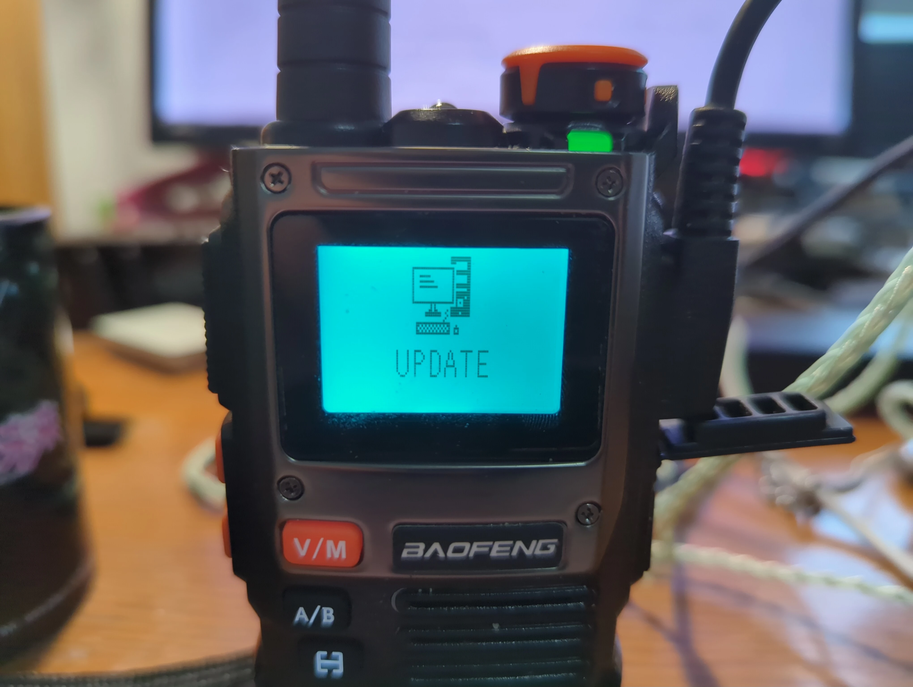
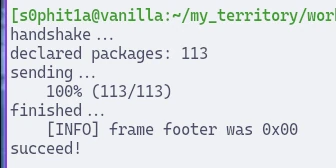
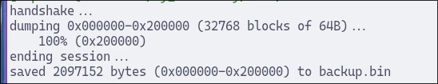
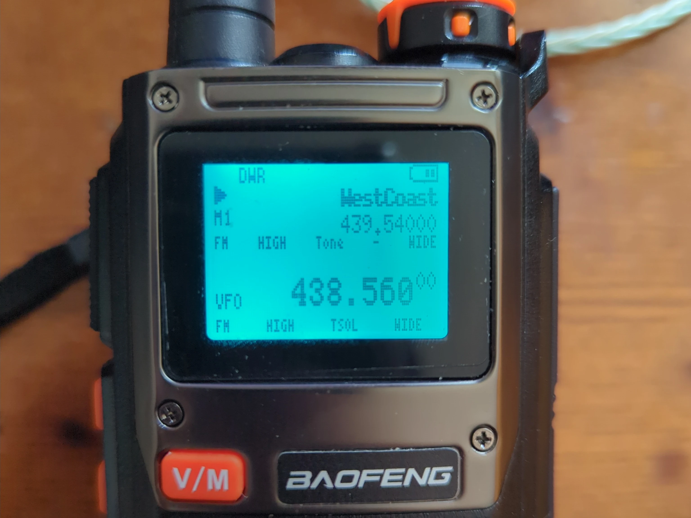

# Flashing Guide

> [!WARNING]
> The factory (stock) UV-K61 firmware has never been publicly released. Once you flash Aura, **you cannot go back to the stock firmware** — not unless someone eventually manages to dump it from a device. Aura is also community-developed firmware and may contain bugs. Flash at your own risk.

## What you'll need

- A working Python 3 environment with [`pyserial`](https://pypi.org/project/pyserial/) installed. This guide assumes you already have that set up.
- A USB-to-TTL programming cable compatible with the Quansheng UV-K5/UV-K6 series — the same cable works for Aura.
- `aura.bin`, downloaded from this repository's GitHub Releases page.

## Step 1: Enter UPDATE mode

With the radio powered off, hold down **Side Key 1** and **Side Key 2**, then turn the radio on. The screen shows `UPDATE`, confirming you're in bootloader/flashing mode.



## Step 2: Connect the cable

Plug the programming cable in between the radio and your computer.

## Step 3: Run the flash tool

```sh
python tools/flash.py aura.bin /dev/ttyUSB0
```

On Windows, replace `/dev/ttyUSB0` with the cable's COM port (e.g. `COM3` — check Device Manager if you're not sure which one).

> [!IMPORTANT]
> Don't unplug the cable while flashing is in progress.
>
> If flashing gets interrupted, that's fine — power the radio off, repeat Step 1 to re-enter UPDATE mode, and try again. If turn the power knob won't turn the radio off, just pull the battery — that's safe, there's nothing to worry about.

## Step 4: Confirm success

If the terminal prints `succeed!` and the radio reboots on its own, flashing succeeded.



If the radio does **not** reboot automatically, the firmware wasn't actually written — this is a known bug. Power the radio off and repeat from Step 1.

## First boot: FORMAT FLASH?

On first boot after flashing, the radio shows `FORMAT FLASH?`. Pressing **MENU** here formats part of the SPI flash. This does *not* touch saved channels or calibration data, but backing up first is still recommended.

### Backing up SPI flash (recommended)

While still on the `FORMAT FLASH?` screen:

1. Plug in the programming cable.
2. Run:
   ```sh
   python tools/dump_aura_spiflash.py /dev/ttyUSB0 backup.bin
   ```
   (again, replace `/dev/ttyUSB0` with the right port on Windows)
3. The radio switches to an `AURA CPS PROGRAMMING...` screen and reads out the full 2 MB flash chip. This takes a few minutes. If it errors out partway, just run the command again.
4. When it finishes, you'll have a `backup.bin` file — keep it somewhere safe.



### Finishing setup

Back on the radio, press **MENU** to format the flash. The radio boots into the main UI.



You're done! From here you can move on to importing SSTV images, satellite data, or a custom boot logo.
